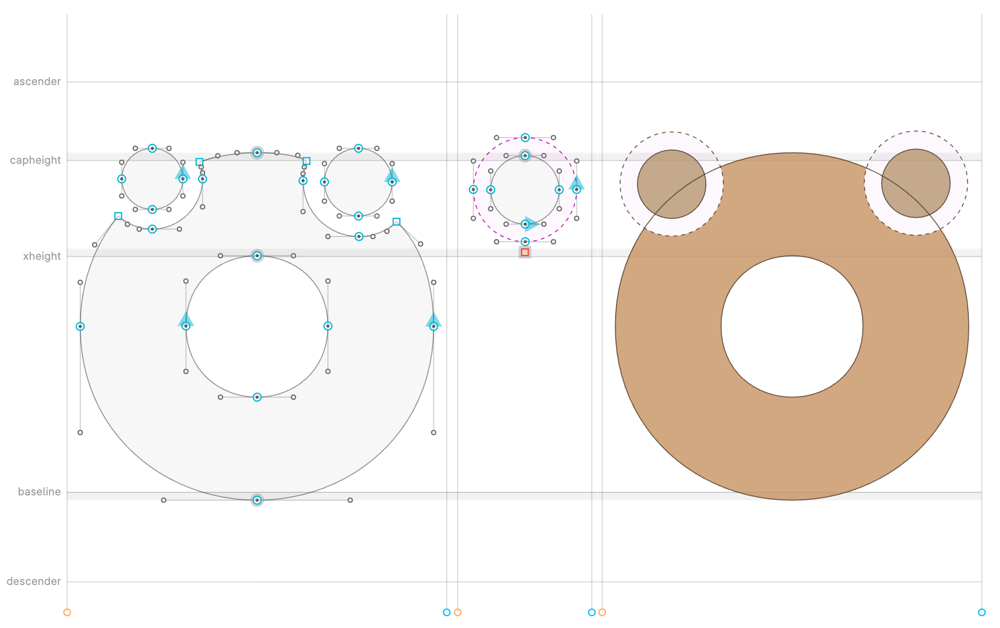

# FIP001 — Path boolean operations

A closed path can be marked as a **boolean operator** on everything **below**
it in the layer’s shape list. Paths and components share that list: their
relative order is the stacking order. The operator path itself is omitted
from the compiled outline.

Two operations:

| Value | Effect on the subject below |
| --- | --- |
| `subtraction` | Punch a hole: NonZero **difference** (`subject − op`) |
| `intersection` | Keep only the overlap: NonZero **intersection** (`subject ∩ op`) |

Editors keep the original nodes. Compilers flatten, apply the ops, and export
only the remaining additive contours.

**Status:** `subtraction` is specified and implemented. `intersection` is part
of this FIP but not implemented in code yet.

## Motivation

Designers often need a hole or a clip that stays editable: an accent that
cuts a bowl, a halo around a mark, or a contour that keeps only what lies
inside it — without destructive booleaning or reverse-winding tricks. Those
approaches lose the operator as an object, and they do not say how an
operator on a **component** should interact with paths on the **host**.

This FIP stores a flag on the operator path and defines one stacking rule so
editors and compilers agree.

## Intended use

This is aimed at **single-weight** fonts, and only at outlines that already
live on **one glyph layer** in the source, not marks attached in shaping.

Compile decomposes any glyph whose own paths **or** component tree contain at
least one boolean operator, then flattens those outlines into that glyph. The
result is baked into the exported contours. Marks that the **shaper** attaches
at runtime (`GPOS` mark-to-base, mark-to-mark, `ccmp` that only positions, and so
on) never enter that list, so they cannot punch or clip a base. If
`dieresiscomb` is drawn as a combining mark next to `O`, this FIP does
nothing. The same accent must be a **component on `Odieresis`** (or another
precomposed glyph) so flatten can see both the bowl and the operators.

That flatten is a poor fit for variable fonts: it drops component sharing,
and it can introduce outline incompatibility — including from self-overlaps
that interpolated cleanly while they stayed inside a component, then vanish
or change after flatten. It can still work on a VF in limited cases, if
applied carefully.

Glyphs with no boolean operator in their tree keep their components.

## Why a FIP, not OpenType

The honest home for this would be the **OpenType** (or COLR) paint model: the
shaper or renderer would boolean glyphs as they are composed, including marks
attached on the fly. That is unlikely to ship. Boolean ops on live outlines
are expensive, hard to hint, and a poor match for existing raster pipelines.
This FIP is the small alternative: a source flag and a compile step that
bakes the result into a static glyph. No new table or binary flags, no runtime cost beyond a
slightly more complex outline.

## Storage

On each operator **path** (not on the glyph, not on the font):

| Key | Value |
| --- | --- |
| `fip001-boolean` | `"subtraction"` or `"intersection"` |

Other values are reserved. No key means an ordinary additive path.

Round-trip the key on the path object:

- **Glyphs** (`.glyphs` / `.glyphspackage`): path `attr["fip001-boolean"]`.
  Intermediate models may also keep `format_specific["fip001-boolean"]`.
- **UFO / Designspace, Babelfont JSON, FontLab VFJ**, and similar: the same
  key on the path’s custom / format-specific dictionary.

The flag is per path, per layer. Matching interpolating layers should carry
the same flag at the same shape indexes. Background layers need not be
processed.

## Stacking

A layer is one ordered list of shapes (paths and components mixed). That list
is the z-order:

- **Earlier** = below (subject to later operators).
- **Later** = above (covers the result of earlier operators).

Paths and components are not two stacks. A component between two paths sits
between those paths. Reordering shapes changes the boolean result.

Compile sees paths only. Before the boolean walk it:

1. Finds every glyph whose own paths or **component tree** contain at least
   one operator path.
2. **Decomposes** those glyphs so each component is replaced **in place** by
   the referenced glyph’s shapes, with the component transform applied.
   Nested components expand the same way.
3. Walks the flat closed-path list bottom to top:
   - Additive closed paths accumulate as the subject.
   - A **closed** `subtraction` path replaces that subject with NonZero
     **difference** (`subject − op`) and is not kept.
   - A **closed** `intersection` path replaces that subject with NonZero
     **intersection** (`subject ∩ op`) and is not kept.
   - Additive paths **after** that operator sit on the result (they are not
     cut or clipped by it).
   - Open paths are never operators.

An operator that lived inside a component only affects what appears
**before** it after flatten: earlier paths of that component, plus earlier
sibling shapes of the host. Host shapes listed **after** that component are
not affected.

Fill rule: **NonZero**. The compiled font does not store `fip001-boolean`.

## Example

`O` is the base. **Precomposed** `Odieresis` is `O` plus two `dotaccentcomb`
components — not `O` with combining marks attached by the shaper.
Each `dotaccentcomb` has a **dot** and an extra closed path marked `subtraction`.
Those punches cut a halo out of `O` around each dot. The dots stay on top, so
they are not eaten.

After flatten, order is `O`, then (per mark) the punch, then the dot. If a
punch were last in `dotaccentcomb`, it would cut its own dot.

`example.py` is the same walk for both ops.

_On the left, the traditional way of punching out halos destructively. In the middle, a `dotaccent` component with a subtraction outline sitting under a normal outline. On the right, a composite glyph with automatic non-destructive subtraction at design-time._

Intersection uses the same stacking: an `intersection` path would keep only
the part of `O` (and anything else below it) that lies inside that path, then
omit itself; later dots would still sit on top.

## Preview

Live preview should match compiled coverage: additive fill only where the
binary has ink. A subtraction above a solid punches that solid. An
intersection above a solid keeps only the overlap. An additive above an
operator covers the result.

## Notes

Geometry can use a robust path boolean (for example Linesweeper `binary_op`
with `FillRule::NonZero` and `BinaryOp::Difference` or `BinaryOp::Intersection`).
Editors may approximate the same coverage on canvas without rewriting source
nodes.
